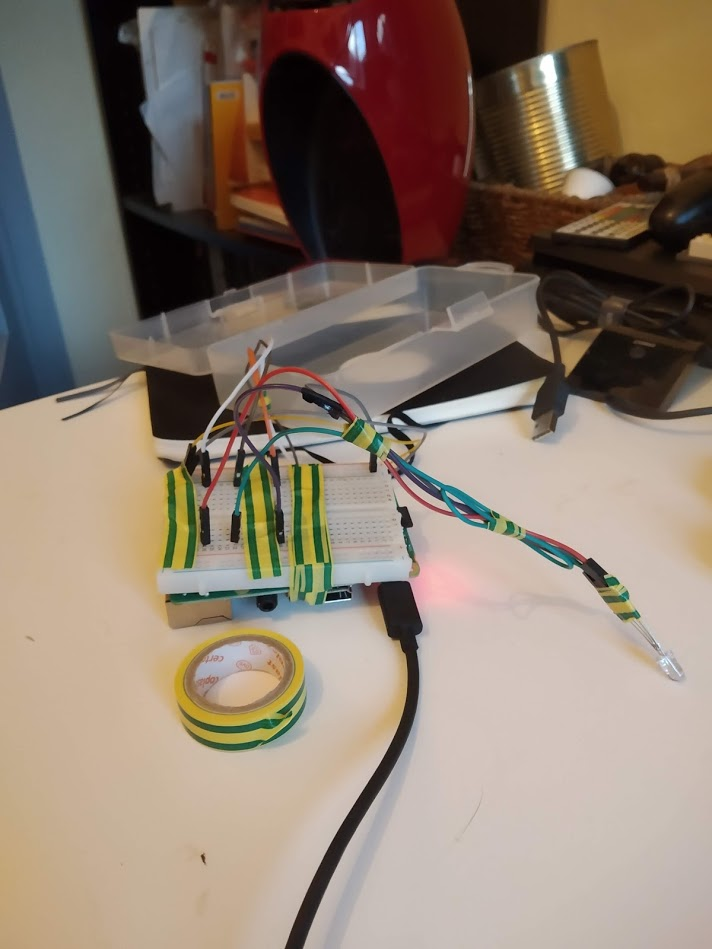

# WifiLamp
This is RGB led (that can be extended to a full lamp easily) controlled over the internet with a website.
The concept is to have a Flask server able to interact with GPIO of Raspberry and the website using AJAX requests and JS can change color to the LED.

